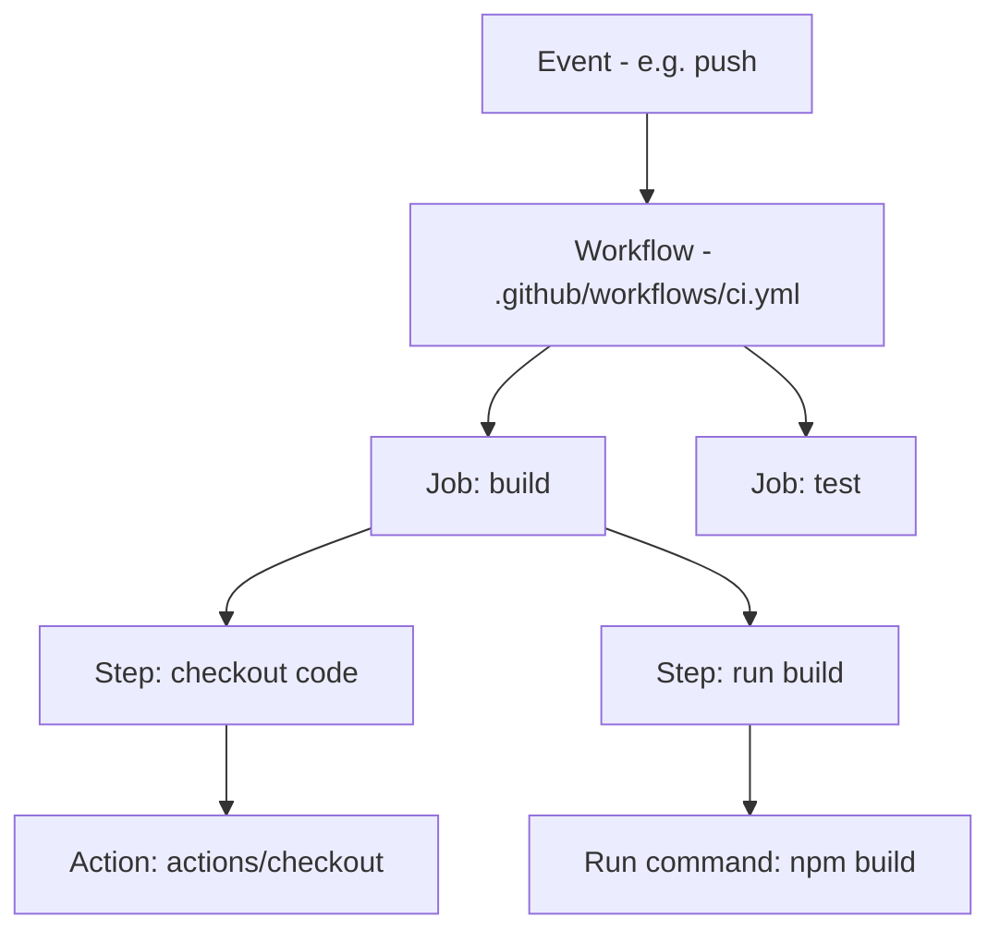
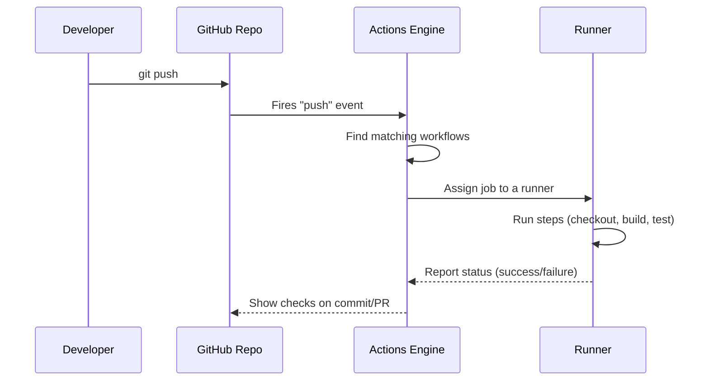
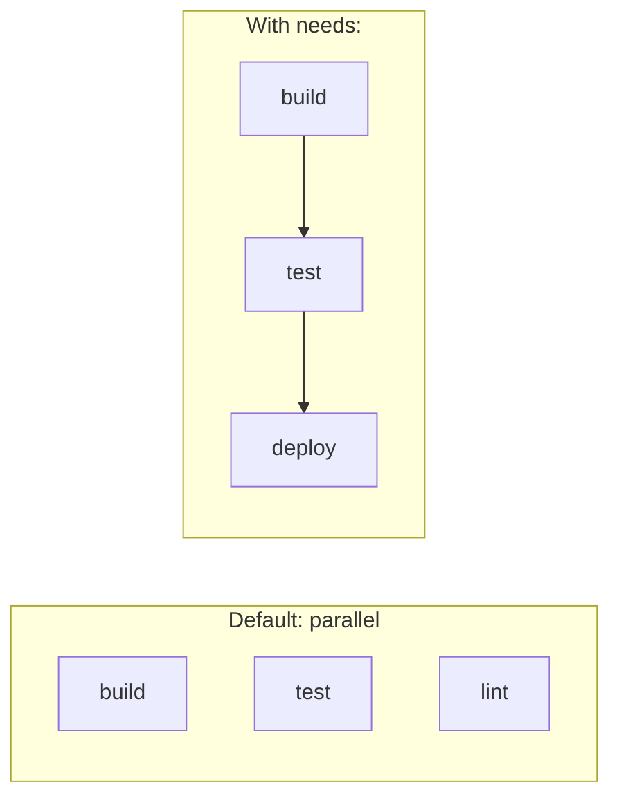
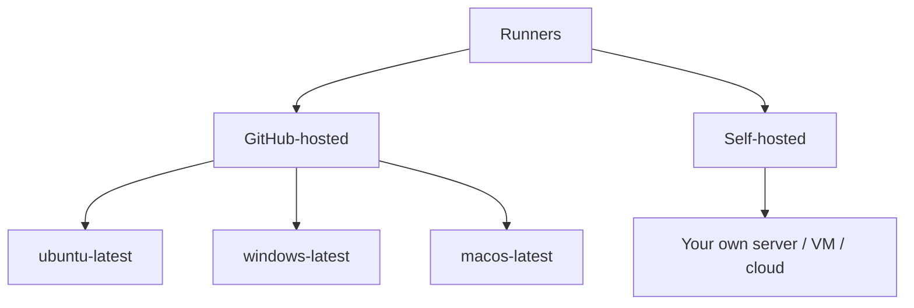

# 01 — Introduction & Architecture

## What is GitHub Actions?

**GitHub Actions** is GitHub's built-in **CI/CD** (Continuous Integration / Continuous Delivery) and **automation** platform. It lets you automate tasks directly in your repository in response to **events**.

Use it to:
- **CI** — build, test, and lint code on every push/PR.
- **CD** — deploy apps to servers, cloud, or app stores.
- **Automation** — label issues, greet contributors, run scheduled jobs, publish packages.

> Launched by GitHub in **2019**. Workflows are defined in **YAML** files inside `.github/workflows/`.

---

## Key Characteristics

| Feature | Description |
|--------|-------------|
| **Event-driven** | Workflows run in response to events (push, PR, schedule, manual, etc.). |
| **YAML-based** | Workflows are declared in `.github/workflows/*.yml`. |
| **Native to GitHub** | No external CI server needed; tightly integrated with repos, PRs, issues. |
| **Reusable Actions** | Prebuilt building blocks from the **Marketplace** or your own. |
| **Runners** | Jobs run on GitHub-hosted or self-hosted machines. |
| **Matrix builds** | Test across multiple OS/versions in parallel. |
| **Secrets management** | Built-in encrypted secrets & variables. |

---

## Core Concepts (the hierarchy)



**Hierarchy:** `Event → Workflow → Jobs → Steps → Actions/Commands`

| Term | Definition |
|------|-----------|
| **Event** | A trigger that starts a workflow (push, pull_request, schedule…). |
| **Workflow** | An automated process defined in a YAML file. A repo can have many. |
| **Job** | A set of steps that run on the **same runner**. Jobs run in **parallel** by default. |
| **Step** | An individual task: either an **action** or a **shell command** (`run`). |
| **Action** | A reusable unit of code (e.g., `actions/checkout`). |
| **Runner** | A server that executes a job (GitHub-hosted or self-hosted). |

---

## How a Workflow Runs (execution flow)



**In words:**
1. An **event** happens (e.g., a push).
2. GitHub finds **workflows** whose triggers match.
3. Each **job** is assigned to a **runner** (a fresh VM/container).
4. The runner executes the **steps** in order.
5. Status (✅/❌) is reported back on the commit/PR.

---

## Jobs Run in Parallel (unless you add dependencies)



- By default all jobs run **at the same time**.
- Use **`needs:`** to force order (e.g., deploy only after tests pass).

---

## Runners



| Type | Pros | Cons |
|------|------|------|
| **GitHub-hosted** | Zero maintenance, fresh VM each run, many OS options | Usage limits/cost, no custom hardware |
| **Self-hosted** | Custom hardware/software, inside your network, cost control | You maintain & secure it |

> Each GitHub-hosted job runs on a **clean, isolated** virtual machine that is destroyed afterward.

---

## Where Workflows Live

```
your-repo/
└── .github/
    └── workflows/
        ├── ci.yml          # each YAML file = one workflow
        ├── deploy.yml
        └── nightly.yml
```

- Must be in **`.github/workflows/`**.
- File extension: **`.yml`** or **`.yaml`**.
- Each file is an independent workflow.

---

## Minimal Example

```yaml
name: CI                      # workflow name
on: push                      # event trigger

jobs:
  build:                      # job id
    runs-on: ubuntu-latest    # runner
    steps:
      - name: Checkout code
        uses: actions/checkout@v4   # an action

      - name: Say hello
        run: echo "Hello, GitHub Actions!"   # a shell command
```

---

## GitHub Actions vs Other CI/CD Tools

| Feature | GitHub Actions | Jenkins | GitLab CI | CircleCI |
|--------|----------------|---------|-----------|----------|
| Hosting | Cloud (or self-hosted) | Self-hosted | Cloud/self-hosted | Cloud |
| Config | YAML | Groovy (Jenkinsfile) | YAML | YAML |
| Integration | Native to GitHub | Plugins | Native to GitLab | GitHub/Bitbucket |
| Marketplace | Yes (large) | Plugins | Limited | Orbs |
| Setup effort | Very low | High | Low | Low |

---

## Key Takeaways

- GitHub Actions = **event-driven CI/CD & automation** native to GitHub.
- Hierarchy: **Event → Workflow → Jobs → Steps → Actions**.
- Workflows live in **`.github/workflows/*.yml`**.
- **Jobs run in parallel** by default; use **`needs:`** for order.
- Jobs execute on **GitHub-hosted** or **self-hosted runners**.
