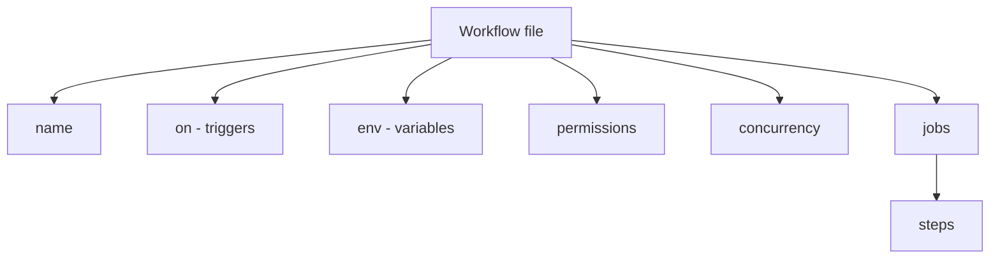
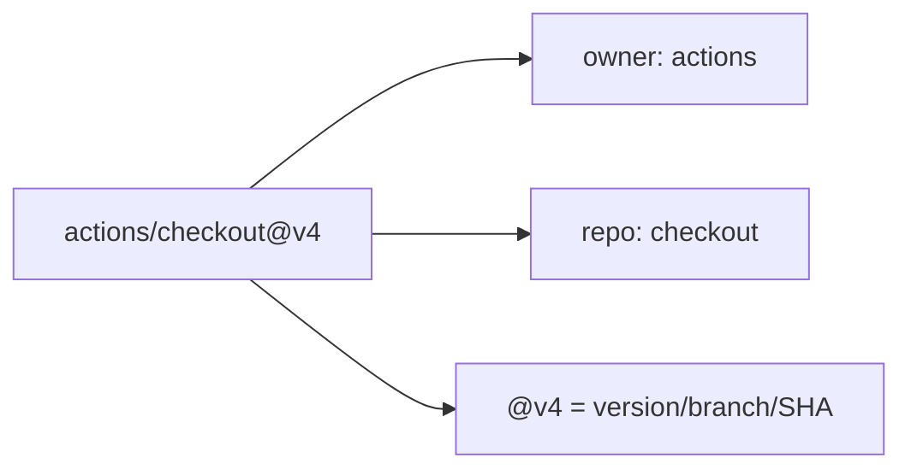

# 02 — Workflow Syntax (YAML)

Workflows are written in **YAML** in `.github/workflows/`. This file explains every top-level key.

---

## YAML Recap (essentials)

```yaml
key: value                 # key-value (space after colon required)
list:                      # a list
  - item1
  - item2
nested:
  child: value             # indent = 2 spaces, NEVER tabs
boolean: true              # true/false
string: "hello world"      # quotes optional, needed for special chars
```

> Same YAML rules as Ansible: **spaces not tabs**, **space after colon**, indentation = structure.

---

## Full Workflow Skeleton

```yaml
name: CI Pipeline            # 1. Workflow name (shown in UI)

on:                          # 2. Events that trigger it
  push:
    branches: [main]

env:                         # 3. Workflow-level environment variables
  NODE_ENV: production

defaults:                    # 4. Default settings for all run steps
  run:
    shell: bash

concurrency:                 # 5. Cancel in-progress duplicate runs
  group: ci-${{ github.ref }}
  cancel-in-progress: true

permissions:                 # 6. GITHUB_TOKEN permissions
  contents: read

jobs:                        # 7. The work to do
  build:
    runs-on: ubuntu-latest
    steps:
      - uses: actions/checkout@v4
      - run: echo "Building..."
```

---

## Top-Level Keys Explained



| Key | Purpose |
|-----|---------|
| `name` | Display name of the workflow (optional). |
| `on` | **Required.** Event(s) that trigger the workflow. |
| `env` | Environment variables available to all jobs/steps. |
| `defaults` | Default `run` settings (shell, working-directory). |
| `concurrency` | Limit/cancel concurrent runs in the same group. |
| `permissions` | Scope the automatic `GITHUB_TOKEN` permissions. |
| `jobs` | **Required.** The jobs to execute. |

---

## The `jobs` Block

```yaml
jobs:
  build:                        # job ID (unique)
    name: Build Application     # display name (optional)
    runs-on: ubuntu-latest      # runner
    needs: []                   # dependencies (other job IDs)
    if: github.ref == 'refs/heads/main'   # conditional
    timeout-minutes: 30
    env:
      STAGE: build
    steps:
      - uses: actions/checkout@v4
      - name: Install
        run: npm ci
      - name: Build
        run: npm run build
```

| Job Key | Purpose |
|---------|---------|
| `runs-on` | Which runner to use. |
| `needs` | Other jobs that must finish first. |
| `if` | Condition to run the job. |
| `strategy` | Matrix / parallel configuration. |
| `env` | Job-level env vars. |
| `timeout-minutes` | Max runtime before cancel. |
| `steps` | Ordered list of tasks. |
| `outputs` | Values passed to dependent jobs. |
| `container` | Run job inside a Docker container. |
| `services` | Sidecar containers (e.g., a DB for tests). |

---

## Steps — `uses` vs `run`

A step is **either** an action **or** a shell command.

```yaml
steps:
  # Option A: run an ACTION
  - name: Checkout
    uses: actions/checkout@v4       # uses = an action
    with:                            # inputs to the action
      fetch-depth: 0

  # Option B: run SHELL commands
  - name: Install & Test
    run: |                           # run = shell commands
      npm ci
      npm test
    working-directory: ./app
    shell: bash
    env:
      CI: true
```

| Step Key | Purpose |
|----------|---------|
| `name` | Display name. |
| `uses` | Reference an action (`owner/repo@version`). |
| `run` | Run shell command(s). |
| `with` | Inputs for the action. |
| `env` | Step-level env vars. |
| `if` | Conditional execution. |
| `id` | Give the step an ID (to reference its outputs). |
| `continue-on-error` | Don't fail the job if this step fails. |
| `working-directory` | Directory to run `run` commands in. |

> **Rule:** a single step uses **either `uses` or `run`**, never both.

---

## Multi-line Commands

```yaml
- name: Multiple commands
  run: |                 # "|" preserves newlines → runs each line
    echo "Line 1"
    echo "Line 2"
    npm run build

- name: Folded
  run: >                 # ">" folds newlines into spaces
    echo "This is all
    on one logical line"
```

---

## Referencing Actions (versioning)

```yaml
- uses: actions/checkout@v4              # major version tag (recommended)
- uses: actions/checkout@v4.1.1          # specific version
- uses: actions/checkout@8f4b7f8...      # full commit SHA (most secure)
- uses: ./.github/actions/my-action      # local action in the repo
- uses: docker://alpine:3.18             # a Docker image
```



---

## Complete Real Example

```yaml
name: Node CI

on:
  push:
    branches: [main]
  pull_request:

permissions:
  contents: read

jobs:
  test:
    runs-on: ubuntu-latest
    steps:
      - name: Checkout
        uses: actions/checkout@v4

      - name: Setup Node
        uses: actions/setup-node@v4
        with:
          node-version: 20
          cache: npm

      - name: Install dependencies
        run: npm ci

      - name: Run tests
        run: npm test
```

---

## Key Takeaways

- Workflows are **YAML** with required keys **`on`** and **`jobs`**.
- A **job** has `runs-on` + `steps`; a **step** uses **either `uses`** (action) **or `run`** (command).
- `with` passes inputs to actions; `env` sets variables at workflow/job/step levels.
- Pin actions to a **version tag or SHA** for stability/security.
- `|` preserves newlines in multi-line `run` blocks.
