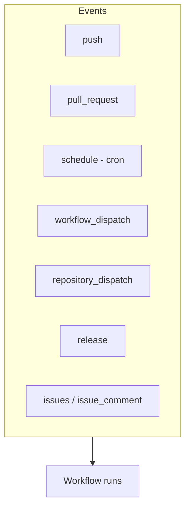
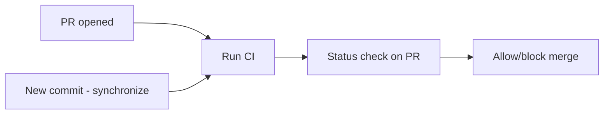
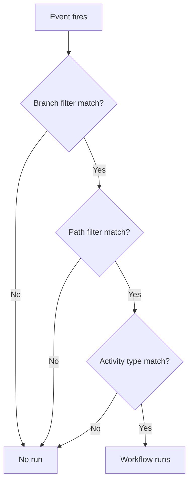

# 03 — Events & Triggers (`on`)

The **`on`** key defines **what triggers** a workflow. Events are the heart of GitHub Actions.



---

## Event Categories

| Category | Examples |
|----------|----------|
| **Webhook events** | `push`, `pull_request`, `issues`, `release`, `fork` |
| **Scheduled** | `schedule` (cron) |
| **Manual** | `workflow_dispatch`, `repository_dispatch` |
| **Workflow events** | `workflow_call`, `workflow_run` |

---

## 1. `push`

Runs when commits are pushed.

```yaml
on:
  push:
    branches:
      - main
      - 'release/**'          # wildcard
    branches-ignore:
      - 'temp/**'
    paths:
      - 'src/**'              # only when these files change
    paths-ignore:
      - '**.md'               # ignore doc-only changes
    tags:
      - 'v*'                  # tag pushes like v1.0.0
```

> You can use **either** `branches` **or** `branches-ignore`, not both. Same for `paths`/`paths-ignore`.

---

## 2. `pull_request`

Runs on PR activity. Great for CI checks before merge.

```yaml
on:
  pull_request:
    types: [opened, synchronize, reopened]   # default: opened, synchronize, reopened
    branches: [main]
    paths: ['src/**']
```

Common `types`: `opened`, `closed`, `reopened`, `synchronize` (new commits), `ready_for_review`, `labeled`.



> **`pull_request` vs `pull_request_target`:** `pull_request` runs in the context of the **PR branch** (limited secrets for forks — safer). `pull_request_target` runs in the **base branch** context (has secrets — use with caution for security).

---

## 3. `schedule` (cron)

Run on a time schedule using **POSIX cron** syntax (UTC).

```yaml
on:
  schedule:
    - cron: '0 2 * * *'      # every day at 02:00 UTC
    - cron: '*/15 * * * *'   # every 15 minutes
```

### Cron format
```
┌───────── minute (0-59)
│ ┌─────── hour (0-23)
│ │ ┌───── day of month (1-31)
│ │ │ ┌─── month (1-12)
│ │ │ │ ┌─ day of week (0-6, Sun=0)
│ │ │ │ │
* * * * *
```

| Cron | Meaning |
|------|---------|
| `0 0 * * *` | Daily at midnight |
| `0 9 * * 1` | Mondays at 09:00 |
| `*/30 * * * *` | Every 30 minutes |
| `0 0 1 * *` | First day of each month |

> Scheduled runs use the **default branch** and may be delayed under heavy load.

---

## 4. `workflow_dispatch` (manual trigger)

Adds a **"Run workflow"** button in the UI and supports **inputs**.

```yaml
on:
  workflow_dispatch:
    inputs:
      environment:
        description: 'Target environment'
        required: true
        default: 'staging'
        type: choice
        options: [staging, production]
      version:
        description: 'Version to deploy'
        required: false
        type: string
      debug:
        type: boolean
        default: false
```

Use the inputs:
```yaml
jobs:
  deploy:
    runs-on: ubuntu-latest
    steps:
      - run: echo "Deploying ${{ inputs.version }} to ${{ inputs.environment }}"
```

---

## 5. `repository_dispatch` (external/API trigger)

Trigger from an external system via the REST API.

```yaml
on:
  repository_dispatch:
    types: [deploy-command]
```

```bash
# Trigger it from outside
curl -X POST \
  -H "Authorization: token $GITHUB_TOKEN" \
  https://api.github.com/repos/OWNER/REPO/dispatches \
  -d '{"event_type":"deploy-command"}'
```

---

## 6. Other Useful Events

```yaml
on:
  release:
    types: [published]        # when a release is published
  issues:
    types: [opened, labeled]  # issue automation
  issue_comment:
    types: [created]          # comment triggers (e.g., /deploy)
  workflow_run:               # chain workflows
    workflows: ["CI"]
    types: [completed]
  fork:                       # someone forks the repo
  watch:                      # someone stars the repo
    types: [started]
```

---

## Multiple Events

```yaml
on: [push, pull_request]     # shorthand list

# or expanded with filters
on:
  push:
    branches: [main]
  pull_request:
  workflow_dispatch:
```

---

## Activity Types

Many events have **`types`** to narrow when they fire:

```yaml
on:
  pull_request:
    types: [opened, closed]   # only fire on open or close
```

Without `types`, the event uses its **default** activity types.

---

## Filtering Summary



| Filter | Applies to |
|--------|-----------|
| `branches` / `branches-ignore` | push, pull_request |
| `tags` / `tags-ignore` | push |
| `paths` / `paths-ignore` | push, pull_request |
| `types` | most events |

---

## Key Takeaways

- **`on`** defines triggers: **`push`**, **`pull_request`**, **`schedule`**, **`workflow_dispatch`**, and more.
- Filter with **`branches`**, **`paths`**, **`tags`**, and **`types`**.
- **`workflow_dispatch`** = manual runs with **inputs**; **`schedule`** = cron (UTC).
- Prefer **`pull_request`** over **`pull_request_target`** for security with forks.
