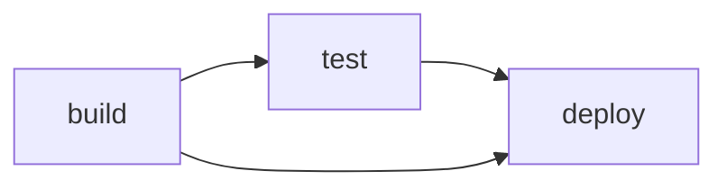
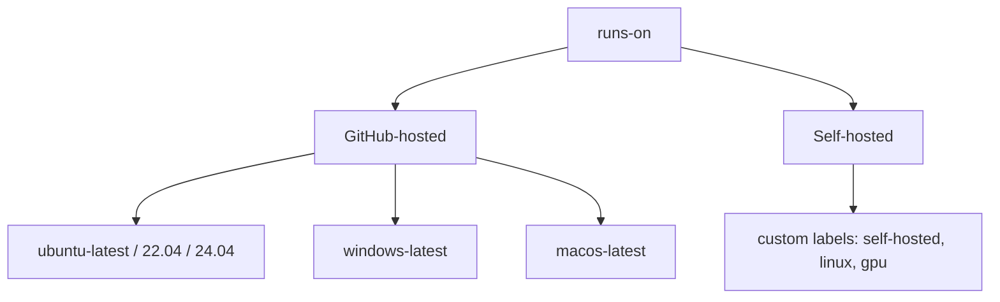
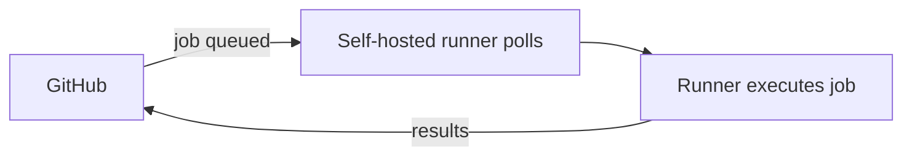
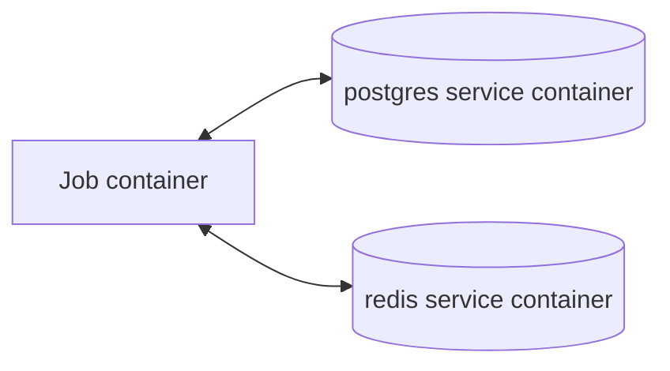

# 04 — Jobs, Steps & Runners

## Jobs

A **job** is a group of steps that run on the **same runner**. Each job runs in a **fresh, isolated environment**.

```yaml
jobs:
  build:                      # job ID
    runs-on: ubuntu-latest
    steps:
      - run: echo "build"
  test:
    runs-on: ubuntu-latest
    steps:
      - run: echo "test"
```

- Jobs run **in parallel** by default.
- Each job gets a **clean VM/container**.
- Data does **not** persist between jobs unless you use **artifacts** or **outputs**.

---

## Job Dependencies — `needs`

Force jobs to run in order.

```yaml
jobs:
  build:
    runs-on: ubuntu-latest
    steps: [ { run: echo build } ]

  test:
    needs: build              # waits for build
    runs-on: ubuntu-latest
    steps: [ { run: echo test } ]

  deploy:
    needs: [build, test]      # waits for both
    runs-on: ubuntu-latest
    steps: [ { run: echo deploy } ]
```



If a needed job **fails**, dependent jobs are **skipped** (unless you override with `if: always()`).

---

## Passing Data Between Jobs — Job Outputs

Because jobs are isolated, use **outputs** to pass small values.


```yaml
jobs:
  setup:
    runs-on: ubuntu-latest
    outputs:
      version: ${{ steps.get_version.outputs.version }}   # expose output
    steps:
      - id: get_version
        run: echo "version=1.2.3" >> "$GITHUB_OUTPUT"

  build:
    needs: setup
    runs-on: ubuntu-latest
    steps:
      - run: echo "Building version ${{ needs.setup.outputs.version }}"
```

> For large files, use **artifacts** (see file 07), not outputs.

---

## Steps

A **step** is a single task within a job. Steps run **sequentially** and share the **same filesystem/environment**.

```yaml
steps:
  - name: Checkout
    uses: actions/checkout@v4

  - name: Install
    run: npm ci

  - name: Test
    id: test                       # give it an id
    run: npm test

  - name: Report
    if: steps.test.outcome == 'success'
    run: echo "Tests passed!"
```

### Step Outputs
```yaml
- id: build
  run: echo "artifact=app.zip" >> "$GITHUB_OUTPUT"

- run: echo "Built ${{ steps.build.outputs.artifact }}"
```

### `continue-on-error`
```yaml
- name: Optional lint
  run: npm run lint
  continue-on-error: true    # job continues even if this fails
```

---

## Runners

The machine that executes a job.



### GitHub-Hosted Runners
```yaml
runs-on: ubuntu-latest       # most common, cheapest
runs-on: windows-latest
runs-on: macos-latest        # for iOS/macOS builds
```

| Label | OS |
|-------|-----|
| `ubuntu-latest` | Latest Ubuntu LTS |
| `windows-latest` | Latest Windows Server |
| `macos-latest` | Latest macOS |

Each comes **pre-installed** with common tools (git, docker, node, python, etc.).

### Self-Hosted Runners
```yaml
runs-on: [self-hosted, linux, x64]   # match by labels
```

Use when you need: custom hardware (GPU), access to a private network, specific software, or cost control at scale.



> **Security note:** avoid self-hosted runners on **public repos** — forked PRs could run malicious code on your machine.

---

## Running Jobs in Containers

Run a whole job inside a Docker container:

```yaml
jobs:
  build:
    runs-on: ubuntu-latest
    container:
      image: node:20-alpine
      env:
        NODE_ENV: test
    steps:
      - run: node --version     # runs inside the container
```

### Service Containers (e.g., a database for tests)
```yaml
jobs:
  test:
    runs-on: ubuntu-latest
    services:
      postgres:
        image: postgres:16
        env:
          POSTGRES_PASSWORD: secret
        ports:
          - 5432:5432
        options: >-
          --health-cmd pg_isready
          --health-interval 10s
    steps:
      - run: psql -h localhost -U postgres -c "SELECT 1;"
```



---

## Job Matrix (preview — see file 08)

Run the same job across multiple configurations:

```yaml
jobs:
  test:
    runs-on: ${{ matrix.os }}
    strategy:
      matrix:
        os: [ubuntu-latest, windows-latest]
        node: [18, 20]
    steps:
      - uses: actions/setup-node@v4
        with:
          node-version: ${{ matrix.node }}
```

This creates **4 parallel jobs** (2 OS × 2 Node versions).

---

## Job & Step Control Keys (summary)

| Key | Level | Purpose |
|-----|-------|---------|
| `runs-on` | job | Choose runner |
| `needs` | job | Dependencies |
| `if` | job/step | Conditional execution |
| `strategy.matrix` | job | Parallel variations |
| `timeout-minutes` | job/step | Max runtime |
| `continue-on-error` | job/step | Don't fail on error |
| `outputs` | job | Pass values to other jobs |
| `container` | job | Run inside a container |
| `services` | job | Sidecar containers |
| `environment` | job | Deployment environment + protection |

---

## Key Takeaways

- **Jobs** run in **parallel** (isolated VMs); order them with **`needs`**.
- Pass small values between jobs with **`outputs`**; large files with **artifacts**.
- **Steps** run sequentially and share the runner's filesystem.
- Choose a runner with **`runs-on`** (GitHub-hosted vs self-hosted).
- Use **`container`** and **`services`** for reproducible environments and test dependencies.
