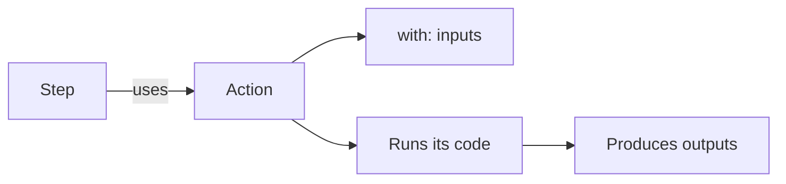
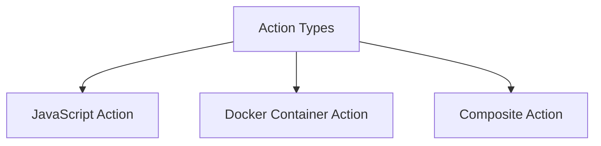
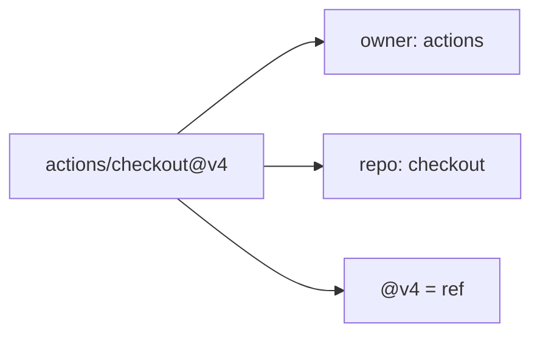
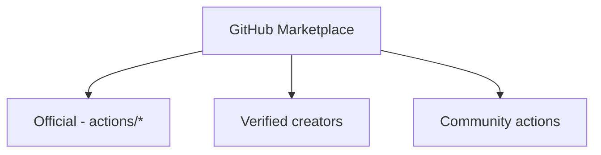

# 05 — Actions & Marketplace

## What is an Action?

An **action** is a **reusable unit of code** — a packaged task you can drop into a step with `uses:`. Actions save you from rewriting common logic (checkout, setup languages, upload artifacts, deploy).



---

## Types of Actions



| Type | How it works | Best for |
|------|--------------|----------|
| **JavaScript** | Runs Node.js directly on the runner | Fast, cross-platform actions |
| **Docker** | Runs inside a Docker container | Specific OS/tools/dependencies (Linux only) |
| **Composite** | Bundles multiple steps into one action | Grouping reusable steps (no code) |

---

## Using an Action

```yaml
steps:
  - name: Checkout repository
    uses: actions/checkout@v4      # owner/repo@version
    with:                           # inputs
      fetch-depth: 0
      token: ${{ secrets.GITHUB_TOKEN }}
```

### Anatomy of `uses`


| Format | Example | Notes |
|--------|---------|-------|
| Public action | `actions/checkout@v4` | Most common |
| Specific version | `actions/checkout@v4.1.1` | Pinned |
| Commit SHA | `actions/checkout@8f4b...` | Most secure |
| Local action | `./.github/actions/greet` | In your repo |
| Docker image | `docker://alpine:3.18` | Direct image |
| Subdirectory | `owner/repo/path@v1` | Action in a subfolder |

---

## Essential Official Actions

| Action | Purpose |
|--------|---------|
| `actions/checkout@v4` | **Clone your repo** into the runner (needed in almost every workflow). |
| `actions/setup-node@v4` | Install Node.js + npm caching. |
| `actions/setup-python@v5` | Install Python. |
| `actions/setup-java@v4` | Install Java/JDK. |
| `actions/upload-artifact@v4` | Save files from a run. |
| `actions/download-artifact@v4` | Retrieve saved files. |
| `actions/cache@v4` | Cache dependencies to speed up runs. |
| `docker/build-push-action@v5` | Build & push Docker images. |
| `actions/github-script@v7` | Run JS with the GitHub API. |

### Example: Node setup with caching
```yaml
- uses: actions/checkout@v4
- uses: actions/setup-node@v4
  with:
    node-version: 20
    cache: npm            # auto-caches ~/.npm
- run: npm ci
```

---

## Inputs (`with`) and Outputs

```yaml
- name: Cache dependencies
  id: cache                       # id to reference outputs
  uses: actions/cache@v4
  with:                           # inputs
    path: ~/.npm
    key: npm-${{ hashFiles('package-lock.json') }}

- name: Check cache result
  run: echo "Cache hit? ${{ steps.cache.outputs.cache-hit }}"   # output
```

---

## GitHub Marketplace

The **[Marketplace](https://github.com/marketplace?type=actions)** hosts thousands of community & official actions.



### Choosing a safe action
- ✅ Prefer **official** (`actions/*`) or **verified** creators.
- ✅ Check **stars, recent activity, and open issues**.
- ✅ **Pin to a commit SHA** for untrusted third-party actions.
- ✅ Review the action's **source code** and required **permissions**.
- ❌ Avoid abandoned actions with no recent updates.

---

## Building Your Own Action (quick look)

Every action needs an **`action.yml`** metadata file. (Full detail in file 09.)

### Composite action example — `.github/actions/greet/action.yml`
```yaml
name: 'Greet'
description: 'Greets a user'
inputs:
  who:
    description: 'Name to greet'
    required: true
    default: 'World'
outputs:
  message:
    description: 'The greeting'
    value: ${{ steps.set.outputs.message }}
runs:
  using: 'composite'
  steps:
    - id: set
      shell: bash
      run: echo "message=Hello, ${{ inputs.who }}" >> "$GITHUB_OUTPUT"
```

Use it:
```yaml
- uses: ./.github/actions/greet
  with:
    who: Priyanshu
```

---

## Action vs Reusable Workflow (don't confuse them)

| | Action | Reusable Workflow |
|-|--------|-------------------|
| Scope | A single **step** | An entire **workflow/job** |
| Called with | `uses:` in a step | `uses:` at the **job** level (`workflow_call`) |
| Contains | One task | Multiple jobs/steps |
| File | `action.yml` | `.github/workflows/*.yml` |

---

## Key Takeaways

- **Actions** are reusable steps referenced with **`uses: owner/repo@version`**.
- Three types: **JavaScript**, **Docker**, **Composite**.
- **`actions/checkout`** is required in nearly every workflow to get your code.
- Pass **inputs via `with`**, read **outputs via `steps.<id>.outputs.*`**.
- Use the **Marketplace**, but **pin third-party actions to a SHA** for security.
