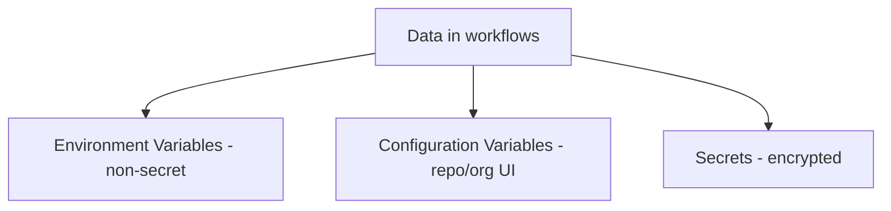
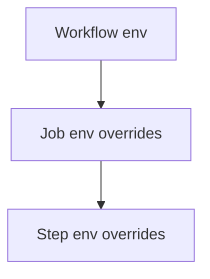
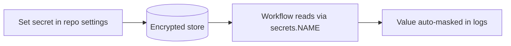
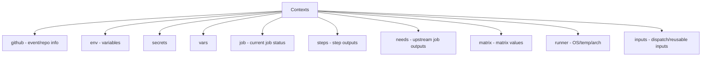
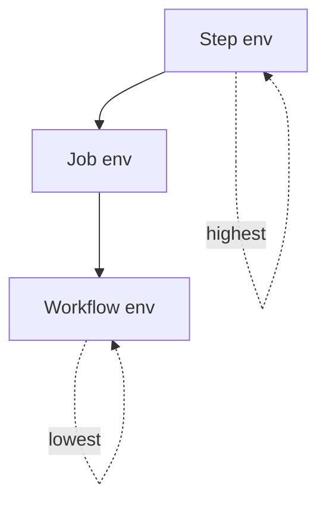

# 06 — Variables, Secrets & Contexts

## Three Kinds of Data



| Type | Encrypted? | Use for | Access |
|------|-----------|---------|--------|
| **env vars** | No | Non-sensitive config | `$VAR` / `${{ env.VAR }}` |
| **Configuration variables** | No | Reusable non-secret values (set in UI) | `${{ vars.NAME }}` |
| **Secrets** | Yes | Passwords, tokens, keys | `${{ secrets.NAME }}` |

---

## Environment Variables (`env`)

Defined at **workflow**, **job**, or **step** level. Inner scopes override outer.

```yaml
env:                          # workflow-level (all jobs)
  APP_NAME: myapp

jobs:
  build:
    runs-on: ubuntu-latest
    env:                      # job-level
      STAGE: build
    steps:
      - name: Show vars
        env:                  # step-level
          GREETING: hello
        run: |
          echo "$APP_NAME"    # shell syntax
          echo "${{ env.STAGE }}"   # expression syntax
          echo "$GREETING"
```



### Two ways to reference
| Syntax | When |
|--------|------|
| `$VAR` or `${VAR}` | Inside a `run` shell command |
| `${{ env.VAR }}` | Anywhere in the workflow (evaluated before the shell) |

### Setting env vars dynamically
```yaml
- name: Set an env var for later steps
  run: echo "BUILD_ID=12345" >> "$GITHUB_ENV"

- name: Use it in a later step
  run: echo "Build is $BUILD_ID"
```

> `$GITHUB_ENV` persists a variable to **subsequent steps** in the same job.

---

## Default Environment Variables

GitHub provides many built-ins automatically:

| Variable | Example |
|----------|---------|
| `GITHUB_REPOSITORY` | `owner/repo` |
| `GITHUB_REF` | `refs/heads/main` |
| `GITHUB_SHA` | commit SHA |
| `GITHUB_ACTOR` | user who triggered |
| `GITHUB_WORKSPACE` | checkout directory |
| `GITHUB_RUN_ID` | unique run ID |
| `RUNNER_OS` | Linux/Windows/macOS |

```yaml
- run: echo "Commit $GITHUB_SHA on $GITHUB_REF"
```

---

## Configuration Variables (`vars`)

Non-secret values set in **Settings → Secrets and variables → Actions → Variables** (repo/org/environment level). Good for reusable, visible config.

```yaml
- run: echo "Deploying to ${{ vars.DEPLOY_URL }}"
  env:
    REGION: ${{ vars.AWS_REGION }}
```

---

## Secrets

**Encrypted** values for sensitive data. Set in **Settings → Secrets and variables → Actions → Secrets**.



```yaml
steps:
  - name: Deploy
    env:
      API_KEY: ${{ secrets.API_KEY }}
    run: ./deploy.sh
```

### Secret Scopes
| Scope | Applies to |
|-------|-----------|
| **Repository** | One repo |
| **Organization** | Many repos (with policy) |
| **Environment** | A specific environment (with protection rules) |

### Secret rules
- Secrets are **masked** (`***`) in logs automatically.
- **Not passed to workflows triggered by forked PRs** (security).
- Cannot be used in the **`if`** condition at job level directly (use env).
- Max size ~48 KB.

### `GITHUB_TOKEN` (automatic secret)
A token auto-created for each run to interact with the repo (create releases, comment on PRs, etc.).

```yaml
permissions:
  contents: write            # scope its powers (least privilege)

steps:
  - run: gh release create v1.0.0
    env:
      GITHUB_TOKEN: ${{ secrets.GITHUB_TOKEN }}
```

---

## Contexts

**Contexts** are objects containing run information, accessed via **`${{ }}`** expression syntax.



| Context | Contains | Example |
|---------|----------|---------|
| `github` | Event, repo, actor, ref, SHA | `${{ github.actor }}` |
| `env` | Environment variables | `${{ env.APP_NAME }}` |
| `vars` | Configuration variables | `${{ vars.REGION }}` |
| `secrets` | Secrets | `${{ secrets.API_KEY }}` |
| `job` | Current job info/status | `${{ job.status }}` |
| `steps` | Outputs of prior steps | `${{ steps.build.outputs.id }}` |
| `needs` | Outputs of needed jobs | `${{ needs.setup.outputs.version }}` |
| `matrix` | Current matrix values | `${{ matrix.os }}` |
| `runner` | Runner details | `${{ runner.os }}` |
| `inputs` | Workflow/dispatch inputs | `${{ inputs.environment }}` |

### Common `github` context fields
```yaml
${{ github.repository }}        # owner/repo
${{ github.ref }}              # refs/heads/main
${{ github.ref_name }}         # main
${{ github.sha }}             # commit SHA
${{ github.actor }}           # who triggered
${{ github.event_name }}      # push, pull_request...
${{ github.event.pull_request.number }}
${{ github.workspace }}       # checkout path
${{ github.run_number }}      # incrementing run count
```

---

## Precedence (which value wins)



For env vars: **step > job > workflow**. Secrets/vars are looked up by scope (environment > repo/org).

---

## Practical Example

```yaml
name: Deploy
on: workflow_dispatch

env:
  APP: myapp

jobs:
  deploy:
    runs-on: ubuntu-latest
    environment: production
    steps:
      - uses: actions/checkout@v4

      - name: Deploy
        env:
          API_KEY: ${{ secrets.PROD_API_KEY }}
          REGION: ${{ vars.AWS_REGION }}
        run: |
          echo "Deploying $APP to $REGION by ${{ github.actor }}"
          ./deploy.sh --key "$API_KEY"
```

---

## Key Takeaways

- **env** = non-secret variables (workflow/job/step scope; inner wins).
- **vars** = reusable non-secret config from the UI; **secrets** = encrypted, auto-masked.
- Use **`$GITHUB_ENV`** to pass env vars between steps in a job.
- **Contexts** (`github`, `secrets`, `needs`, `steps`, `matrix`, …) expose run data via **`${{ }}`**.
- Secrets are **not shared with forked-PR** workflows; scope **`GITHUB_TOKEN`** with least privilege.
