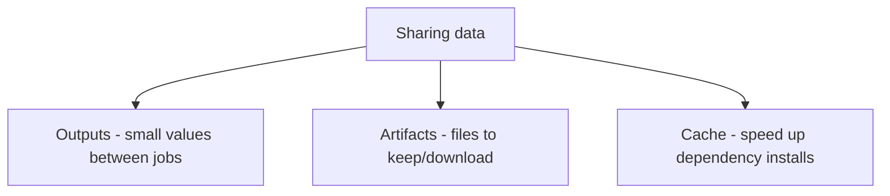
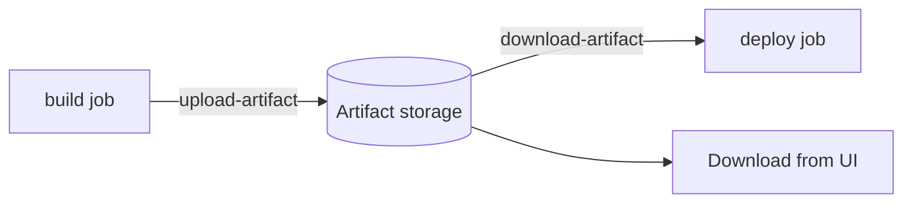
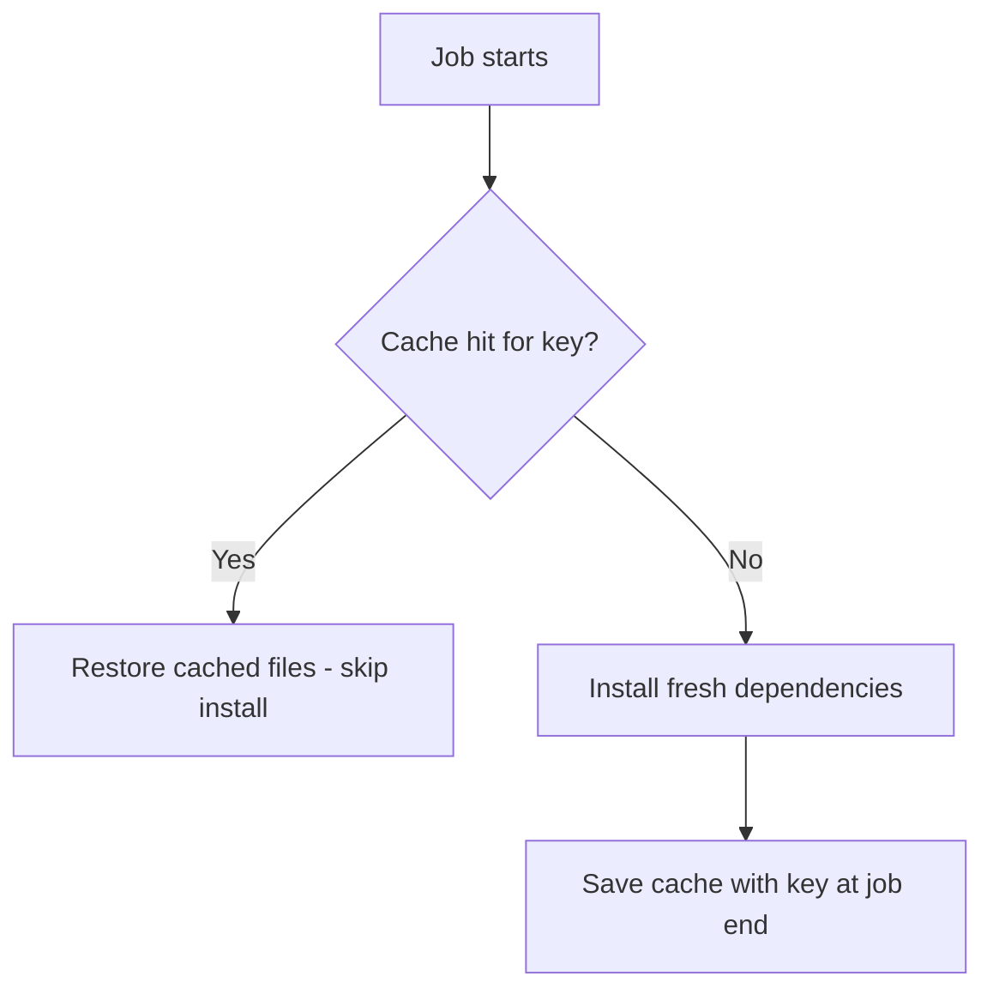
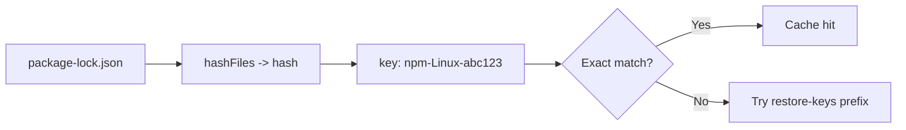
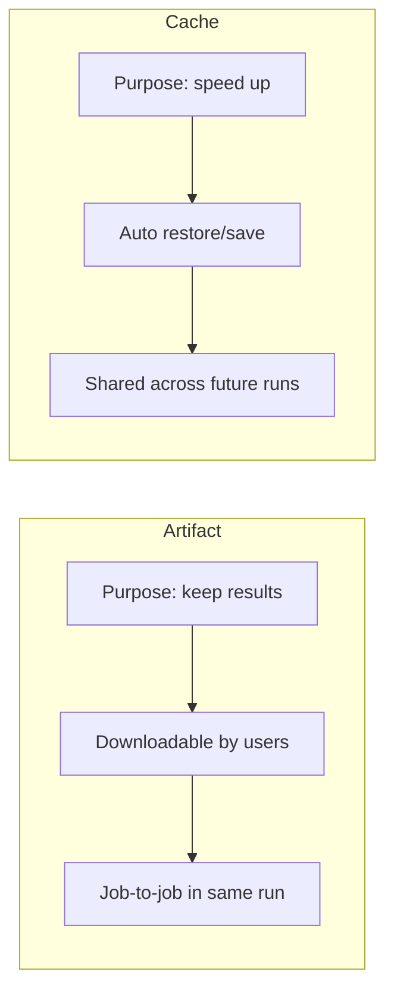

# 07 — Artifacts, Caching & Outputs

Three ways to move/persist data. Know **when** to use each.



| Mechanism | Use for | Persists | Scope |
|-----------|---------|----------|-------|
| **Outputs** | Small strings (version, id) | Within a run | Job → Job |
| **Artifacts** | Files/build output/reports | After the run (download) | Job → Job / user |
| **Cache** | Dependencies (`node_modules`, `~/.m2`) | Across runs | Reused by future runs |

---

## Part A — Outputs (recap)

Pass small values from one step/job to another.

### Step output
```yaml
- id: vars
  run: echo "version=1.2.3" >> "$GITHUB_OUTPUT"

- run: echo "Version is ${{ steps.vars.outputs.version }}"
```

### Job output (between jobs)
```yaml
jobs:
  setup:
    runs-on: ubuntu-latest
    outputs:
      version: ${{ steps.vars.outputs.version }}
    steps:
      - id: vars
        run: echo "version=1.2.3" >> "$GITHUB_OUTPUT"

  build:
    needs: setup
    runs-on: ubuntu-latest
    steps:
      - run: echo "Building ${{ needs.setup.outputs.version }}"
```

---

## Part B — Artifacts

**Artifacts** persist files produced by a job so they can be **downloaded** or used by **later jobs**.



### Upload
```yaml
- name: Build
  run: npm run build          # produces dist/

- name: Upload build output
  uses: actions/upload-artifact@v4
  with:
    name: dist-files
    path: dist/
    retention-days: 7         # optional (default 90)
```

### Download (in a later job)
```yaml
jobs:
  build:
    runs-on: ubuntu-latest
    steps:
      - uses: actions/checkout@v4
      - run: npm ci && npm run build
      - uses: actions/upload-artifact@v4
        with:
          name: dist-files
          path: dist/

  deploy:
    needs: build
    runs-on: ubuntu-latest
    steps:
      - uses: actions/download-artifact@v4
        with:
          name: dist-files
          path: dist/
      - run: ./deploy.sh dist/
```

### Common uses
- Build outputs (binaries, `dist/`, `.jar`, `.zip`)
- Test reports & coverage
- Logs & screenshots (e.g., Playwright failures)
- Passing compiled output from **build** job to **deploy** job

### Upload multiple paths
```yaml
- uses: actions/upload-artifact@v4
  with:
    name: reports
    path: |
      coverage/
      test-results/
      screenshots/
```

> Artifacts count toward storage quota. Use **`retention-days`** to auto-expire.

---

## Part C — Caching

**Cache** reuses files (like dependencies) across workflow runs to make them **faster**. Unlike artifacts, cache is meant to be **re-populated**, not downloaded by users.



### Basic cache
```yaml
- name: Cache node modules
  uses: actions/cache@v4
  with:
    path: ~/.npm
    key: npm-${{ runner.os }}-${{ hashFiles('package-lock.json') }}
    restore-keys: |
      npm-${{ runner.os }}-
```

| Key part | Purpose |
|----------|---------|
| `path` | Directory to cache |
| `key` | Exact cache identity (change → new cache) |
| `restore-keys` | Fallback prefixes for partial matches |
| `hashFiles(...)` | Hash of lockfile → invalidates cache when deps change |

### How the key works


### Built-in caching via setup actions (simpler)
```yaml
- uses: actions/setup-node@v4
  with:
    node-version: 20
    cache: npm            # handles cache automatically!

- uses: actions/setup-python@v5
  with:
    python-version: '3.12'
    cache: pip
```

### Common cache paths
| Language | Path |
|----------|------|
| Node (npm) | `~/.npm` |
| Node (yarn) | `~/.cache/yarn` |
| Python (pip) | `~/.cache/pip` |
| Java (Maven) | `~/.m2/repository` |
| Java (Gradle) | `~/.gradle/caches` |
| Go | `~/go/pkg/mod` |
| Rust (Cargo) | `~/.cargo` |

---

## Artifacts vs Cache (key difference)



| | Artifacts | Cache |
|-|-----------|-------|
| Goal | Store & retrieve outputs | Speed up by reusing deps |
| Downloadable | Yes (UI/API) | No (internal) |
| Scope | Within a run | Across runs |
| Typical content | Build output, reports | `node_modules`, package caches |
| Guaranteed | Yes | Best-effort (can be evicted) |

---

## Job Summaries (bonus)

Write Markdown to the run summary page:

```yaml
- run: |
    echo "## Test Results" >> "$GITHUB_STEP_SUMMARY"
    echo "- Passed: 42" >> "$GITHUB_STEP_SUMMARY"
    echo "- Failed: 0" >> "$GITHUB_STEP_SUMMARY"
```

---

## Key Takeaways

- **Outputs** = pass small strings between steps/jobs (`$GITHUB_OUTPUT`, `needs.*.outputs`).
- **Artifacts** = persist files to download or hand to later jobs (`upload/download-artifact`).
- **Cache** = speed up runs by reusing dependencies, keyed on lockfile hashes.
- Prefer **built-in caching** (`cache: npm`) in setup actions when possible.
- Artifacts are for **results you keep**; cache is for **speed you regenerate**.
