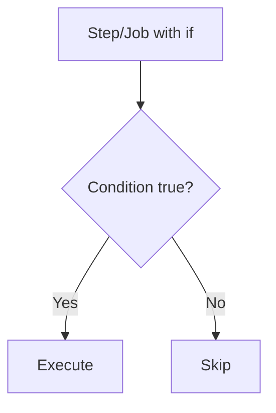
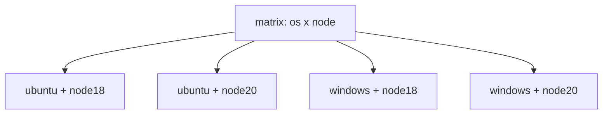
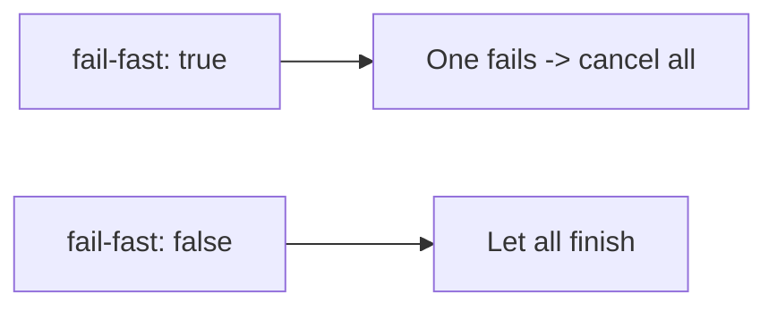
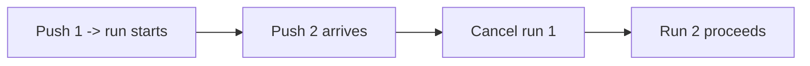

# 08 — Matrix, Conditionals & Expressions

## Part A — Expressions `${{ }}`

Expressions let you compute values, read contexts, and build conditions.

```yaml
${{ <expression> }}
```

```yaml
- run: echo "Repo is ${{ github.repository }}"
- if: ${{ github.event_name == 'push' }}
- run: echo "${{ steps.build.outputs.id }}"
```

### Operators
| Type | Operators |
|------|-----------|
| Comparison | `==`, `!=`, `<`, `<=`, `>`, `>=` |
| Logical | `&&` (and), `||` (or), `!` (not) |
| Grouping | `( )` |

```yaml
if: ${{ github.ref == 'refs/heads/main' && github.event_name == 'push' }}
```

### Built-in Functions
| Function | Purpose | Example |
|----------|---------|---------|
| `contains(a, b)` | Does a contain b? | `contains(github.ref, 'release')` |
| `startsWith(a, b)` | Prefix check | `startsWith(github.ref, 'refs/tags/')` |
| `endsWith(a, b)` | Suffix check | `endsWith(github.ref, '/main')` |
| `format(str, ...)` | String formatting | `format('Hello {0}', github.actor)` |
| `join(list, sep)` | Join array | `join(matrix.*, ', ')` |
| `toJSON(x)` | Convert to JSON | `toJSON(github.event)` |
| `fromJSON(x)` | Parse JSON | `fromJSON('[1,2,3]')` |
| `hashFiles(path)` | Hash of files | `hashFiles('**/package-lock.json')` |

### Status Check Functions (for `if`)
| Function | Meaning |
|----------|---------|
| `success()` | Previous steps succeeded (default) |
| `failure()` | A previous step failed |
| `cancelled()` | The run was cancelled |
| `always()` | Always run, regardless of status |

---

## Part B — Conditionals (`if`)

Run a job or step only when a condition is true.



### Job-level
```yaml
jobs:
  deploy:
    if: github.ref == 'refs/heads/main'    # deploy only from main
    runs-on: ubuntu-latest
    steps:
      - run: ./deploy.sh
```

### Step-level
```yaml
steps:
  - name: Upload logs on failure
    if: failure()                          # only if something failed
    uses: actions/upload-artifact@v4
    with:
      name: logs
      path: logs/

  - name: Cleanup
    if: always()                           # run no matter what
    run: ./cleanup.sh

  - name: Prod-only step
    if: ${{ github.event_name == 'push' && startsWith(github.ref, 'refs/tags/v') }}
    run: ./release.sh
```

### Common condition recipes
```yaml
if: github.event_name == 'pull_request'
if: github.ref == 'refs/heads/main'
if: startsWith(github.ref, 'refs/tags/')
if: contains(github.event.head_commit.message, '[skip ci]') == false
if: github.actor != 'dependabot[bot]'
if: success() && github.ref == 'refs/heads/main'
```

> Inside `if:`, the `${{ }}` wrapper is optional — GitHub adds it automatically. Both `if: success()` and `if: ${{ success() }}` work.

---

## Part C — Matrix Strategy

Run the **same job** across **multiple combinations** in parallel.



### Basic matrix
```yaml
jobs:
  test:
    runs-on: ${{ matrix.os }}
    strategy:
      matrix:
        os: [ubuntu-latest, windows-latest, macos-latest]
        node: [18, 20, 22]
    steps:
      - uses: actions/checkout@v4
      - uses: actions/setup-node@v4
        with:
          node-version: ${{ matrix.node }}
      - run: npm ci && npm test
```

This creates **9 jobs** (3 OS × 3 Node versions), all in parallel.

### Matrix control options
```yaml
strategy:
  fail-fast: false        # don't cancel others if one fails (default true)
  max-parallel: 2         # limit concurrent matrix jobs
  matrix:
    os: [ubuntu-latest, windows-latest]
    node: [18, 20]
    include:              # add extra combinations / properties
      - os: ubuntu-latest
        node: 20
        experimental: true
    exclude:              # remove specific combinations
      - os: windows-latest
        node: 18
```

| Key | Purpose |
|-----|---------|
| `fail-fast` | If true (default), one failure cancels the rest |
| `max-parallel` | Cap simultaneous matrix jobs |
| `include` | Add extra combos or extra variables to existing combos |
| `exclude` | Remove specific combos |



### Dynamic matrix (from JSON)
```yaml
jobs:
  setup:
    runs-on: ubuntu-latest
    outputs:
      matrix: ${{ steps.set.outputs.matrix }}
    steps:
      - id: set
        run: echo 'matrix={"node":[18,20]}' >> "$GITHUB_OUTPUT"

  test:
    needs: setup
    runs-on: ubuntu-latest
    strategy:
      matrix: ${{ fromJSON(needs.setup.outputs.matrix) }}
    steps:
      - run: echo "Node ${{ matrix.node }}"
```

---

## Part D — Concurrency (cancel duplicate runs)

```yaml
concurrency:
  group: ci-${{ github.ref }}      # group by branch
  cancel-in-progress: true          # cancel older run in the same group
```

Useful to avoid wasting minutes when you push multiple times quickly.



---

## Part E — Timeouts & Continue-on-error

```yaml
jobs:
  test:
    runs-on: ubuntu-latest
    timeout-minutes: 15          # cancel job after 15 min
    steps:
      - run: npm test
        timeout-minutes: 5       # per-step timeout
      - run: npm run flaky
        continue-on-error: true  # don't fail the job
```

---

## Key Takeaways

- **Expressions `${{ }}`** read contexts and compute values; know **operators + functions**.
- **`if:`** controls conditional jobs/steps; use **status functions** (`success()`, `failure()`, `always()`).
- **Matrix** runs a job across many combos in parallel; tune with **`include`/`exclude`/`fail-fast`**.
- **`concurrency`** cancels redundant runs; **`timeout-minutes`** and **`continue-on-error`** control failure behavior.
