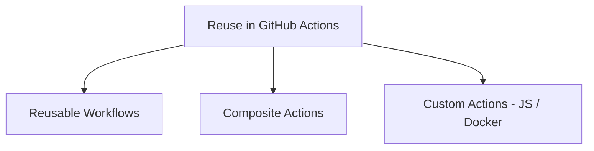
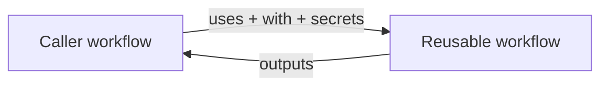
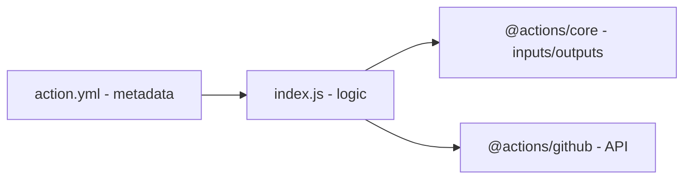
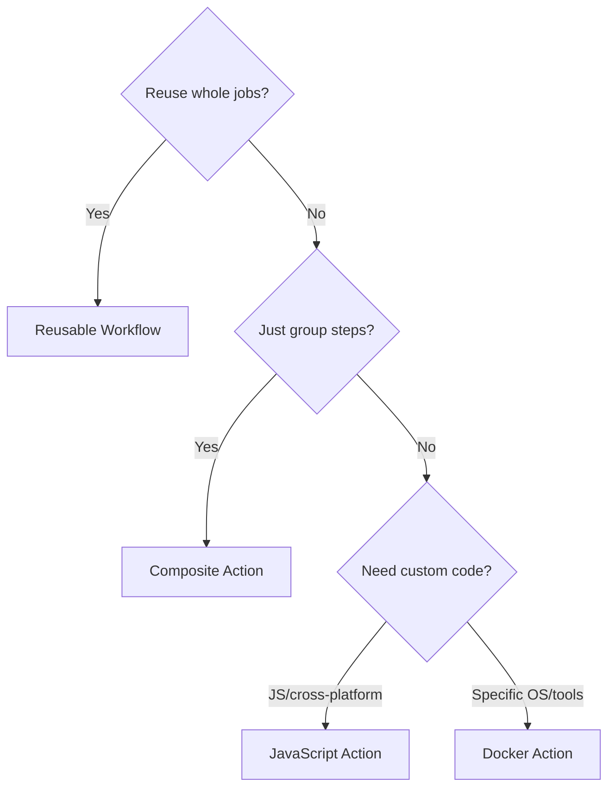

# 09 — Reusable Workflows, Composite & Custom Actions

Three ways to **avoid repetition (DRY)** and share automation.



| Approach | Reuses | Called by |
|----------|--------|-----------|
| **Reusable Workflow** | An entire workflow/jobs | `uses:` at the **job** level |
| **Composite Action** | A set of steps | `uses:` at the **step** level |
| **JS/Docker Action** | Custom code logic | `uses:` at the **step** level |

---

## Part A — Reusable Workflows

Define a workflow once, call it from other workflows. Triggered by **`workflow_call`**.

### The reusable workflow — `.github/workflows/reusable-deploy.yml`
```yaml
name: Reusable Deploy

on:
  workflow_call:                 # makes it callable
    inputs:
      environment:
        required: true
        type: string
      version:
        required: false
        type: string
        default: 'latest'
    secrets:
      deploy_token:
        required: true
    outputs:
      url:
        description: 'Deployed URL'
        value: ${{ jobs.deploy.outputs.url }}

jobs:
  deploy:
    runs-on: ubuntu-latest
    outputs:
      url: ${{ steps.dep.outputs.url }}
    steps:
      - uses: actions/checkout@v4
      - id: dep
        run: |
          echo "Deploying ${{ inputs.version }} to ${{ inputs.environment }}"
          echo "url=https://${{ inputs.environment }}.example.com" >> "$GITHUB_OUTPUT"
        env:
          TOKEN: ${{ secrets.deploy_token }}
```

### The caller workflow
```yaml
name: CI/CD
on:
  push:
    branches: [main]

jobs:
  call-deploy:
    uses: ./.github/workflows/reusable-deploy.yml   # at JOB level
    with:
      environment: production
      version: v1.2.3
    secrets:
      deploy_token: ${{ secrets.DEPLOY_TOKEN }}
```



### Rules
- Called at the **job** level with `uses:`, not inside `steps`.
- Pass data via **`inputs`** and **`secrets`** (use `secrets: inherit` to pass all).
- Can reference from another repo: `owner/repo/.github/workflows/x.yml@v1`.
- Max nesting depth: 4 levels.

```yaml
secrets: inherit     # forward all caller secrets to the reusable workflow
```

---

## Part B — Composite Actions

Bundle **multiple steps** into a single reusable **action**. No code needed — just YAML.

### `.github/actions/setup-project/action.yml`
```yaml
name: 'Setup Project'
description: 'Checkout, install Node, install deps'
inputs:
  node-version:
    description: 'Node version'
    required: false
    default: '20'
outputs:
  cache-hit:
    description: 'Whether deps were cached'
    value: ${{ steps.cache.outputs.cache-hit }}
runs:
  using: 'composite'             # <-- composite action
  steps:
    - uses: actions/checkout@v4

    - uses: actions/setup-node@v4
      with:
        node-version: ${{ inputs.node-version }}

    - id: cache
      uses: actions/cache@v4
      with:
        path: ~/.npm
        key: npm-${{ hashFiles('package-lock.json') }}

    - shell: bash               # shell is REQUIRED for run steps
      run: npm ci
```

### Using it
```yaml
jobs:
  build:
    runs-on: ubuntu-latest
    steps:
      - uses: ./.github/actions/setup-project      # at STEP level
        with:
          node-version: 22
      - run: npm run build
```

> In composite actions, every `run` step **must specify `shell:`**.

---

## Part C — JavaScript Actions

Run Node.js code directly on the runner (fast, cross-platform).

### `action.yml`
```yaml
name: 'Hello Action'
description: 'Greets someone'
inputs:
  who:
    description: 'Who to greet'
    required: true
    default: 'World'
outputs:
  time:
    description: 'The greeting time'
runs:
  using: 'node20'
  main: 'index.js'
```

### `index.js`
```javascript
const core = require('@actions/core');

try {
  const who = core.getInput('who');
  console.log(`Hello, ${who}!`);
  core.setOutput('time', new Date().toISOString());
} catch (error) {
  core.setFailed(error.message);
}
```



---

## Part D — Docker Container Actions

Run inside a Docker container — full control over OS/tools (Linux runners only).

### `action.yml`
```yaml
name: 'Docker Action'
description: 'Runs in a container'
inputs:
  who:
    description: 'Who to greet'
    required: true
runs:
  using: 'docker'
  image: 'Dockerfile'          # or docker://alpine:3.18
  args:
    - ${{ inputs.who }}
```

### `Dockerfile`
```dockerfile
FROM alpine:3.18
COPY entrypoint.sh /entrypoint.sh
RUN chmod +x /entrypoint.sh
ENTRYPOINT ["/entrypoint.sh"]
```

### `entrypoint.sh`
```bash
#!/bin/sh
echo "Hello, $1!"
echo "message=done" >> "$GITHUB_OUTPUT"
```

---

## Choosing the Right Approach



| Need | Use |
|------|-----|
| Standardize an entire pipeline across repos | Reusable Workflow |
| Group repeated setup steps | Composite Action |
| Custom logic, fast, cross-platform | JavaScript Action |
| Specific system dependencies/tools | Docker Action |

---

## Reusable Workflow vs Composite Action

| | Reusable Workflow | Composite Action |
|-|-------------------|------------------|
| Level | Job | Step |
| Contains | Multiple jobs | Steps only |
| Own runner | Yes (its jobs pick runners) | No (runs in caller's job) |
| Secrets | Passed explicitly / `inherit` | Uses caller's context |
| File | `.github/workflows/*.yml` | `action.yml` |

---

## Key Takeaways

- **Reusable workflows** (`workflow_call`) share **whole jobs**; called at **job level** with `inputs`/`secrets`.
- **Composite actions** group **steps** into one action (`using: composite`); `run` steps need `shell:`.
- **JavaScript** and **Docker** actions add **custom code** — JS is fast/cross-platform, Docker gives OS control.
- Every custom action needs an **`action.yml`** metadata file.
- Pick based on scope: whole pipeline → reusable workflow; step group → composite; logic → JS/Docker.
