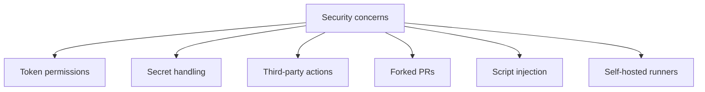
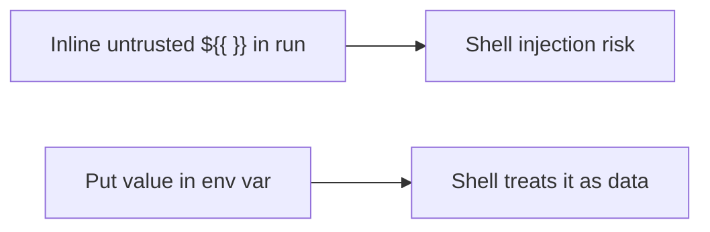
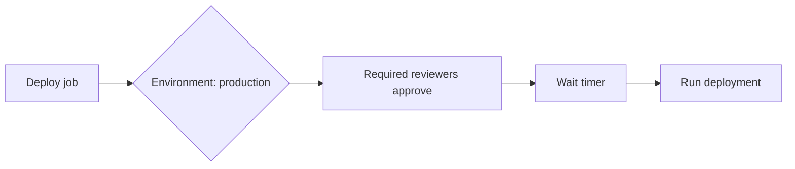
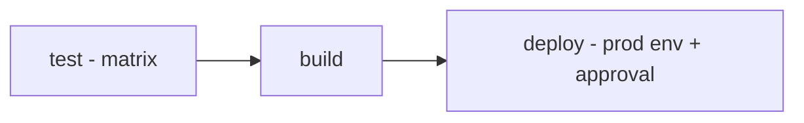

# 10 — Security, Environments, Best Practices & Cheat Sheet

## Part A — Security

CI/CD pipelines are a prime attack target. Follow these practices.



### 1. Least-Privilege `GITHUB_TOKEN`
By default the token can be broad. **Restrict it.**

```yaml
permissions:
  contents: read          # default to read-only
  # grant more only where needed:

jobs:
  release:
    permissions:
      contents: write     # only this job can write
```

> Set `permissions: {}` or `contents: read` at the top, then widen per-job.

### 2. Pin Third-Party Actions to a SHA
Tags can be moved by an attacker; a **commit SHA is immutable**.

```yaml
# Risky (mutable tag)
- uses: some/action@v1

# Safer (immutable SHA)
- uses: some/action@3f2b9a1c8d...   # full 40-char SHA
```

### 3. Never Hardcode Secrets
```yaml
# BAD
- run: ./deploy.sh --key "abc123secret"

# GOOD
- run: ./deploy.sh --key "$API_KEY"
  env:
    API_KEY: ${{ secrets.API_KEY }}
```
Secrets are **auto-masked** in logs, but only if referenced via `secrets.*`.

### 4. Prevent Script Injection
Untrusted input (PR titles, branch names, issue bodies) can inject shell code.

```yaml
# DANGEROUS - attacker controls the title
- run: echo "PR title: ${{ github.event.pull_request.title }}"

# SAFE - pass through an env var (quoted, not interpolated into shell)
- run: echo "PR title: $TITLE"
  env:
    TITLE: ${{ github.event.pull_request.title }}
```



### 5. Forked PR Safety
- Secrets are **not** exposed to workflows from **forked PRs**.
- Avoid **`pull_request_target`** with checkout of PR code + secrets — a classic exploit.
- The `GITHUB_TOKEN` for forked PRs is **read-only** by default.

### 6. Self-Hosted Runner Caution
- Don't use on **public repos** (forks can run arbitrary code).
- Use **ephemeral** runners; isolate from sensitive networks.

### Security checklist
- [ ] `permissions` scoped to least privilege
- [ ] Third-party actions pinned to SHA
- [ ] No secrets in code/logs; use `secrets.*`
- [ ] Untrusted input passed via env vars, not inline
- [ ] Avoid `pull_request_target` with untrusted code
- [ ] Enable **required reviews** and **branch protection**
- [ ] Use **OIDC** for cloud auth instead of long-lived keys

### OIDC (keyless cloud auth) — bonus
```yaml
permissions:
  id-token: write         # required for OIDC
  contents: read

jobs:
  deploy:
    runs-on: ubuntu-latest
    steps:
      - uses: aws-actions/configure-aws-credentials@v4
        with:
          role-to-assume: arn:aws:iam::123:role/gh-deploy
          aws-region: us-east-1
```
No stored AWS keys — GitHub issues a short-lived token. ✅

---

## Part B — Environments & Deployments

**Environments** (e.g., `staging`, `production`) add **protection rules** and scoped secrets.

```yaml
jobs:
  deploy:
    runs-on: ubuntu-latest
    environment:
      name: production
      url: https://myapp.com     # shown in the UI
    steps:
      - run: ./deploy.sh
```



### Protection rules (set in repo settings)
| Rule | Effect |
|------|--------|
| **Required reviewers** | Manual approval before deploy |
| **Wait timer** | Delay before running |
| **Deployment branches** | Restrict which branches can deploy |
| **Environment secrets** | Secrets available only to this environment |

---

## Part C — Best Practices

### Do's
- ✅ **Pin actions** (SHA for third-party, major tag for official).
- ✅ Use **`concurrency`** to cancel redundant runs.
- ✅ **Cache** dependencies for speed.
- ✅ Use **matrix** to test across versions/OS.
- ✅ Keep workflows **small & focused**; extract reusable/composite actions.
- ✅ Scope **`permissions`** and use **environments** for deploys.
- ✅ Add **`timeout-minutes`** to avoid hung jobs.
- ✅ Use **`paths`/`branches` filters** to avoid unnecessary runs.
- ✅ Name steps/jobs clearly for readable logs.

### Don'ts
- ❌ Hardcode secrets or echo them.
- ❌ Interpolate untrusted input directly into `run`.
- ❌ Use mutable tags for untrusted actions.
- ❌ Give `write-all` permissions by default.
- ❌ Run self-hosted runners on public repos.

### Debugging tips
```yaml
# Enable step debug logging (repo secret)
ACTIONS_STEP_DEBUG = true
ACTIONS_RUNNER_DEBUG = true
```
```yaml
- run: echo "::debug::A debug message"
- run: echo "::warning::A warning"
- run: echo "::error::An error"
- run: echo "::group::My group"    # collapsible log section
- run: echo "::endgroup::"
```

---

## Part D — Full Production CI/CD Example

```yaml
name: CI/CD Pipeline

on:
  push:
    branches: [main]
  pull_request:

permissions:
  contents: read

concurrency:
  group: ci-${{ github.ref }}
  cancel-in-progress: true

jobs:
  test:
    runs-on: ubuntu-latest
    strategy:
      matrix:
        node: [18, 20]
    steps:
      - uses: actions/checkout@v4
      - uses: actions/setup-node@v4
        with:
          node-version: ${{ matrix.node }}
          cache: npm
      - run: npm ci
      - run: npm test
      - if: failure()
        uses: actions/upload-artifact@v4
        with:
          name: test-logs-${{ matrix.node }}
          path: logs/

  build:
    needs: test
    runs-on: ubuntu-latest
    steps:
      - uses: actions/checkout@v4
      - uses: actions/setup-node@v4
        with: { node-version: 20, cache: npm }
      - run: npm ci && npm run build
      - uses: actions/upload-artifact@v4
        with:
          name: dist
          path: dist/

  deploy:
    needs: build
    if: github.ref == 'refs/heads/main'
    runs-on: ubuntu-latest
    environment:
      name: production
      url: https://myapp.com
    permissions:
      contents: read
      id-token: write
    steps:
      - uses: actions/download-artifact@v4
        with: { name: dist, path: dist/ }
      - name: Deploy
        env:
          TOKEN: ${{ secrets.DEPLOY_TOKEN }}
        run: ./deploy.sh dist/
```



---

## Part E — Cheat Sheet

### Structure
```yaml
name:            # workflow name
on:              # triggers
permissions:     # token scope
concurrency:     # cancel dup runs
env:             # variables
jobs:
  job_id:
    runs-on:     # runner
    needs:       # dependencies
    if:          # condition
    strategy:    # matrix
    steps:
      - uses:    # action
      - run:     # command
```

### Common expressions
```yaml
${{ github.ref }}                 # refs/heads/main
${{ github.event_name }}          # push / pull_request
${{ github.actor }}               # who triggered
${{ secrets.NAME }}               # a secret
${{ vars.NAME }}                  # a config variable
${{ env.NAME }}                   # env var
${{ steps.id.outputs.x }}         # step output
${{ needs.job.outputs.x }}        # job output
${{ matrix.os }}                  # matrix value
${{ runner.os }}                  # Linux/Windows/macOS
```

### Conditions
```yaml
if: github.ref == 'refs/heads/main'
if: github.event_name == 'pull_request'
if: startsWith(github.ref, 'refs/tags/')
if: success() / failure() / always() / cancelled()
```

### Data passing
```bash
echo "name=value" >> "$GITHUB_OUTPUT"   # step/job output
echo "VAR=value"  >> "$GITHUB_ENV"      # env for later steps
echo "## Summary" >> "$GITHUB_STEP_SUMMARY"   # run summary
```

### Key actions
```yaml
actions/checkout@v4
actions/setup-node@v4         # + cache: npm
actions/upload-artifact@v4
actions/download-artifact@v4
actions/cache@v4
```

---

## Key Takeaways

- **Security first:** least-privilege `permissions`, pin actions to SHA, never inline untrusted input, use **OIDC**.
- **Environments** add approvals, wait timers, and scoped secrets for deployments.
- Speed up with **cache + concurrency**; robustness via **timeouts + matrix**.
- Keep workflows **small, named, and reusable**; filter events to avoid waste.
- Memorize the **cheat sheet** expressions and data-passing commands.
