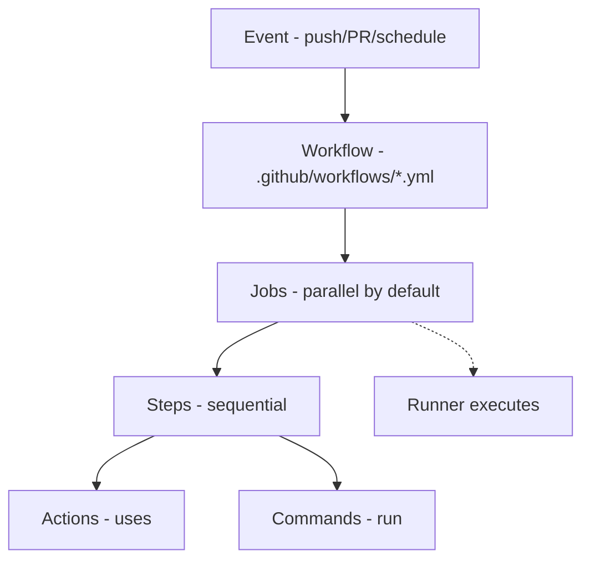

# GitHub Actions Notes ⚙️

Complete, example-driven GitHub Actions notes with diagrams — organized for learning and interview prep.

## 📑 Table of Contents

| # | Topic | What's inside |
|---|-------|---------------|
| 01 | [Introduction & Architecture](01-introduction-architecture.md) | What it is, CI/CD, core concepts, execution flow, runners, tool comparison |
| 02 | [Workflow Syntax (YAML)](02-workflow-syntax.md) | Top-level keys, jobs, steps, `uses` vs `run`, versioning |
| 03 | [Events & Triggers](03-events-triggers.md) | `push`, `pull_request`, `schedule`, `workflow_dispatch`, filters |
| 04 | [Jobs, Steps & Runners](04-jobs-steps-runners.md) | `needs`, outputs, runners, containers, services |
| 05 | [Actions & Marketplace](05-actions-marketplace.md) | Action types, `with`/outputs, official actions, marketplace safety |
| 06 | [Variables, Secrets & Contexts](06-variables-secrets-contexts.md) | `env`, `vars`, `secrets`, `GITHUB_TOKEN`, contexts |
| 07 | [Artifacts, Caching & Outputs](07-artifacts-caching-outputs.md) | Outputs, artifacts, cache, artifacts vs cache |
| 08 | [Matrix, Conditionals & Expressions](08-matrix-conditionals-expressions.md) | `${{ }}`, functions, `if`, matrix, concurrency |
| 09 | [Reusable, Composite & Custom Actions](09-reusable-composite-custom-actions.md) | `workflow_call`, composite, JS & Docker actions |
| 10 | [Security, Environments & Best Practices](10-security-environments-best-practices.md) | Least privilege, SHA pinning, OIDC, environments, cheat sheet |
| 11 | [Interview Questions (Brief)](11-interview-questions.md) | 60 Q&A + rapid-fire one-liners |

---

## 🗺️ Learning Path

```mermaid
flowchart LR
    A[01 Intro & Architecture] --> B[02 Workflow Syntax]
    B --> C[03 Events & Triggers]
    C --> D[04 Jobs, Steps, Runners]
    D --> E[05 Actions & Marketplace]
    E --> F[06 Variables & Secrets]
    F --> G[07 Artifacts & Cache]
    G --> H[08 Matrix & Conditionals]
    H --> I[09 Reusable & Custom Actions]
    I --> J[10 Security & Best Practices]
    J --> K[11 Interview Prep]
```



---

## 🧠 Core Mental Model



**One-liner:** GitHub Actions is an **event-driven CI/CD & automation** platform where **Events** trigger **Workflows** made of **Jobs → Steps**, run on **Runners**.

---

## ⚡ Quick Start

```yaml
# .github/workflows/ci.yml
name: CI
on: [push, pull_request]

jobs:
  build:
    runs-on: ubuntu-latest
    steps:
      - uses: actions/checkout@v4
      - uses: actions/setup-node@v4
        with:
          node-version: 20
          cache: npm
      - run: npm ci
      - run: npm test
```

---

## ✅ Coverage Checklist

- [x] Architecture & core concepts
- [x] Workflow YAML syntax
- [x] Events, triggers & filters
- [x] Jobs, steps, runners, containers/services
- [x] Actions & the Marketplace
- [x] Variables, secrets & contexts
- [x] Artifacts, caching & outputs
- [x] Expressions, conditionals & matrix
- [x] Reusable workflows, composite & custom actions
- [x] Security, environments & best practices
- [x] Interview questions (brief)

> Every file ends with a **Key Takeaways** section and includes **diagrams + examples**.

---

## 🔗 Related

There's also an **Ansible** notes folder in this workspace (`ansible/`) built in the same style.
